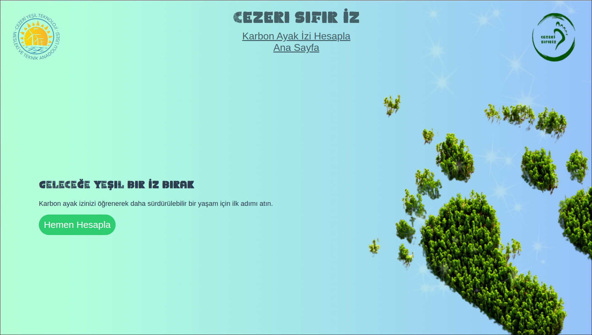

# 🌱 CarbonFootPrint

> 🇬🇧 A simple and educational carbon footprint calculator.  
> 🇹🇷 Basit ve eğitici bir karbon ayak izi hesaplayıcısı.

 <!-- Eğer bir önizleme görseliniz varsa -->

## 📌 About / Hakkında

**CarbonFootPrint**, günlük alışkanlıklarınıza göre yaklaşık karbon ayak izinizi hesaplamanızı sağlayan, çevre bilinci oluşturmayı amaçlayan bir web uygulamasıdır.  
Bu projeyle bireyler, yaşam tarzlarının çevre üzerindeki etkisini görüp daha sürdürülebilir adımlar atabilirler.

**CarbonFootPrint** is a web-based tool that helps individuals estimate their carbon footprint based on their lifestyle habits. The goal is to encourage environmentally conscious decisions by visualizing personal impact.

---

## 🚀 Features / Özellikler

- 📊 **Carbon Calculator** – Basit sorularla karbon ayak izi hesaplama  
- 📱 **Responsive Design** – Mobil ve masaüstü cihazlarla uyumlu  
- 🌍 **Eco Tips** – Emisyonları azaltmak için öneriler  
- ☁️ **Client-Side Only** – Sadece HTML/CSS/JS, sunucu gerekmez

---

## 🛠️ Technologies Used / Kullanılan Teknolojiler

- `HTML5`
- `CSS3`
- `Vanilla JavaScript`

---

## ▶️ Live Demo / Canlı Demo

🟢 [View the website](https://b1laldygn.github.io/CarbonFootPrint)

---

## 📥 Installation / Kurulum

```bash
git clone https://github.com/b1laldygn/CarbonFootPrint.git
cd CarbonFootPrint
